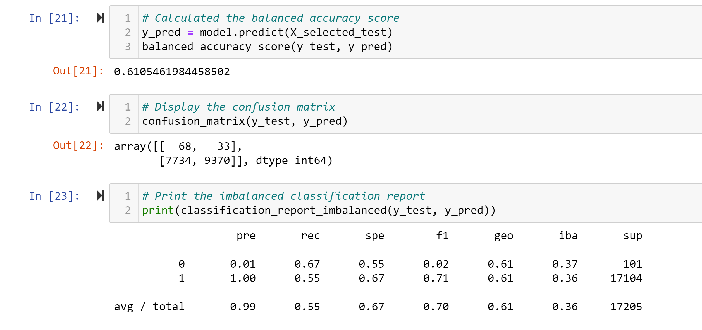
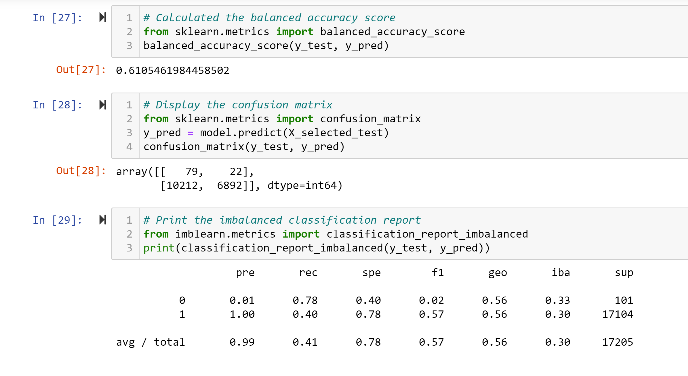
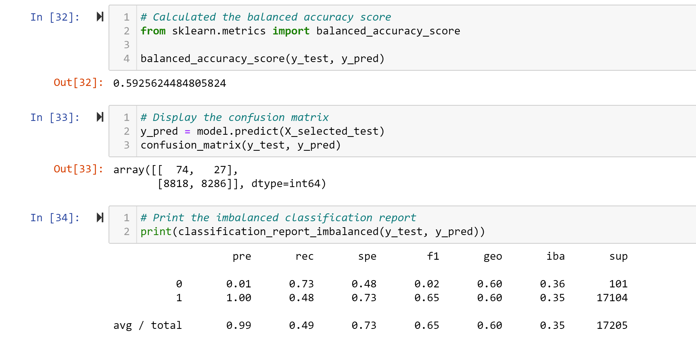
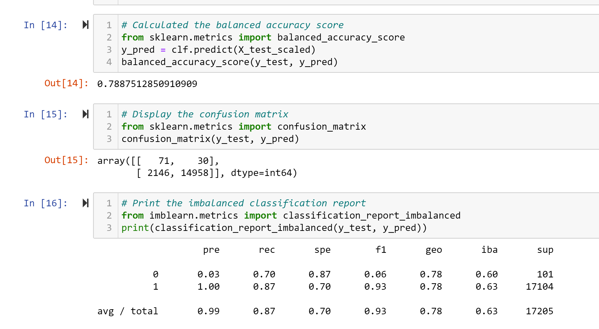
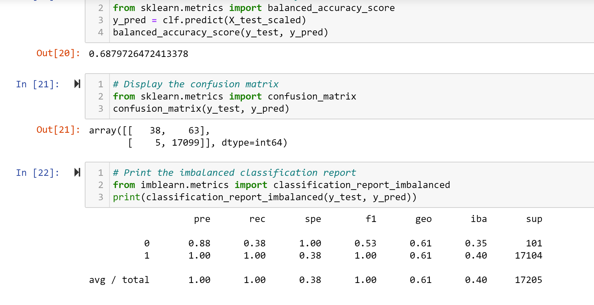

# Credit_Risk_Analysis

## Overview
In this project, I was tasked with finding a machine learning model for a credit card risk data set.  The goal was to see if, by inputting the data into different learning models,  we could come up with an efficient and accurate way of predicting which consumers were most at risk of defaulting on loans.  I ran through numerous models to determine if there were any models that could successfully predict high risk loans and then determined which of these models did the best job.  A list of the different machine learning models is below:

- RandomOverSampler
- SMOTE OverSampler
- Cluster Centroids Undersampling
- SMOTEENN Over/Under Sampling combination
- Balanced Random Forest Classifier
- AdaBoostClassifier

In order to get better results I manipulated the data in the following ways before running the machine learning algorithms
- In the 4 models that included over/Under sampling I chosea set of features to run on.  In the classifiers I began with every column or feature in the list
- Next, I scaled the data to eliminate large numbers skewing the learning model
- I then found the important features of the dataset so that I could narrow my model to fewer columns/features

## Results
For each learning model that was used the following information was extracted.
- A balanced accuracy score was used to determine how often the model made the correct prediction
- A confusion matrix was created to show the number of True/False positives and negatives
- A classification report was created to show the precision, sensitivity, and f1 score of the model

Here are the results for each model:

### Random OverSampler

- Accuracy Score: 62%   This tells us that the model correctly predicted the outcome 62% of the time.
- Precision: .01 for predicting high risk loans and 100% for predicting low risk loans.  These numbers tell very differenct stories.  First, it tells us the model predicted a lot of high risk loans that were not actually high risk (this is the .01 number).  The model also, however, was very good at predicting loans that were low risk as it was correct almost 100(This was rounded up from 99.6) percent of the time.
- Sensitivity: .72 and .52.  This tells us that of the high risk loans in the data set, the model predicted high or low correctly 72 percent of the time.  On the other hand, the model was only successful at correctly predicting the low risk loans 52 percent of the time.

### SMOTE OverSampler

- Accuracy Score: 62%   This tells us that the model correctly predicted the outcome 62% of the time.
- Precision: .01 for predicting high risk loans and 100% for predicting low risk loans.  These numbers tell very differenct stories.  First, it tells us the model predicted a lot of high risk loans that were not actually high risk (this is the .01 number).  The model also, however, was very good at predicting loans that were low risk as it was correct almost 100(This was rounded up from 99.6) percent of the time.
- Sensitivity: .72 and .52.  This tells us that of the high risk loans in the data set, the model predicted high or low correctly 72 percent of the time.  On the other hand, the model was only successful at correctly predicting the low risk loans 52 percent of the time.

### Random OverSampler

- Accuracy Score: 62%   This tells us that the model correctly predicted the outcome 62% of the time.
- Precision: .01 for predicting high risk loans and 100% for predicting low risk loans.  These numbers tell very differenct stories.  First, it tells us the model predicted a lot of high risk loans that were not actually high risk (this is the .01 number).  The model also, however, was very good at predicting loans that were low risk as it was correct almost 100(This was rounded up from 99.6) percent of the time.
- Sensitivity: .72 and .52.  This tells us that of the high risk loans in the data set, the model predicted high or low correctly 72 percent of the time.  On the other hand, the model was only successful at correctly predicting the low risk loans 52 percent of the time.

### Random OverSampler

- Accuracy Score: 62%   This tells us that the model correctly predicted the outcome 62% of the time.
- Precision: .01 for predicting high risk loans and 100% for predicting low risk loans.  These numbers tell very differenct stories.  First, it tells us the model predicted a lot of high risk loans that were not actually high risk (this is the .01 number).  The model also, however, was very good at predicting loans that were low risk as it was correct almost 100(This was rounded up from 99.6) percent of the time.
- Sensitivity: .72 and .52.  This tells us that of the high risk loans in the data set, the model predicted high or low correctly 72 percent of the time.  On the other hand, the model was only successful at correctly predicting the low risk loans 52 percent of the time.

### Random OverSampler

- Accuracy Score: 62%   This tells us that the model correctly predicted the outcome 62% of the time.
- Precision: .01 for predicting high risk loans and 100% for predicting low risk loans.  These numbers tell very differenct stories.  First, it tells us the model predicted a lot of high risk loans that were not actually high risk (this is the .01 number).  The model also, however, was very good at predicting loans that were low risk as it was correct almost 100(This was rounded up from 99.6) percent of the time.
- Sensitivity: .72 and .52.  This tells us that of the high risk loans in the data set, the model predicted high or low correctly 72 percent of the time.  On the other hand, the model was only successful at correctly predicting the low risk loans 52 percent of the time.

### Random OverSampler

- Accuracy Score: 62%   This tells us that the model correctly predicted the outcome 62% of the time.
- Precision: .01 for predicting high risk loans and 100% for predicting low risk loans.  These numbers tell very differenct stories.  First, it tells us the model predicted a lot of high risk loans that were not actually high risk (this is the .01 number).  The model also, however, was very good at predicting loans that were low risk as it was correct almost 100(This was rounded up from 99.6) percent of the time.
- Sensitivity: .72 and .52.  This tells us that of the high risk loans in the data set, the model predicted high or low correctly 72 percent of the time.  On the other hand, the model was only successful at correctly predicting the low risk loans 52 percent of the time.

